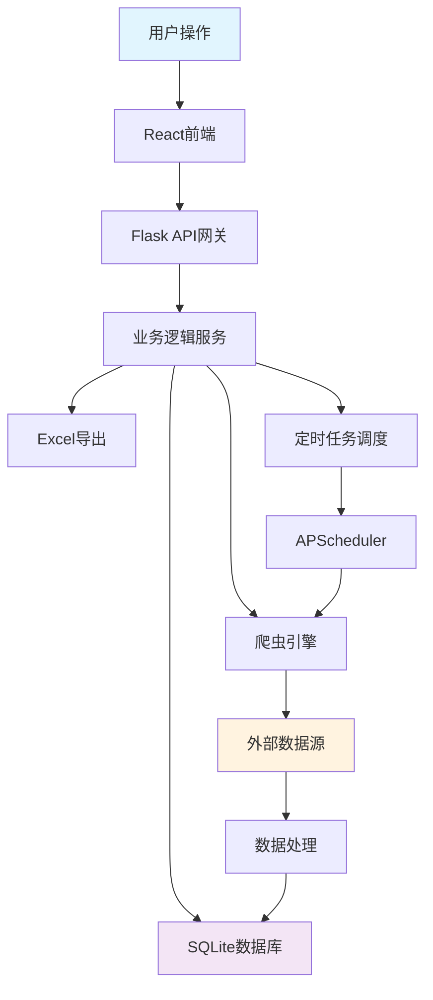

# 全国医院官网扫描与招投标监控系统 - 系统架构设计

**作者：** MiniMax Agent  
**版本：** v1.0  
**日期：** 2025-11-18  
**项目代号：** HospitalTenderMonitor

---

## 🎯 一、项目概述

### 1.1 项目目标
建设一个智能化、自动化的医院招投标监控系统，实现：
- **全国医院官网扫描**：从国家到县级的逐级医院官网自动识别与收集
- **招投标信息监控**：每小时自动巡检医院官网招投标信息
- **数据管理与展示**：支持树形结构展示、CRUD操作、Excel导出
- **离线工作能力**：本地SQLite数据库支持离线使用

### 1.2 核心功能模块
```
医院招投标监控系统
├── 行政区划管理模块 (RegionService)
├── 医院信息管理模块 (HospitalService)  
├── 爬虫引擎模块 (CrawlerEngine)
├── 招投标监控模块 (TenderMonitor)
├── 调度任务模块 (SchedulerService)
├── 数据导出模块 (ExportService)
├── 配置管理模块 (ConfigService)
└── 前端界面模块 (React Frontend)
```

---

## 🏗️ 二、系统架构设计

### 2.1 整体架构图

```
┌─────────────────────────────────────────────────────────────────┐
│                         前端层 (Frontend)                         │
├─────────────────────────────────────────────────────────────────┤
│  React + TypeScript + Ant Design                                │
│  ├─ 树形行政区划组件 (RegionTree)                                │
│  ├─ 医院详情面板 (HospitalPanel)                                 │
│  ├─ 招投标列表 (TenderList)                                     │
│  ├─ 扫描控制台 (ScanConsole)                                    │
│  └─ 设置面板 (SettingsPanel)                                    │
└─────────────────────────────────────────────────────────────────┘
                           ↕ REST API
┌─────────────────────────────────────────────────────────────────┐
│                        后端层 (Backend)                          │
├─────────────────────────────────────────────────────────────────┤
│  Flask + SQLAlchemy + APScheduler                               │
│  ├─ API网关层 (API Gateway)                                     │
│  │   ├─ /api/regions/*  - 行政区划接口                           │
│  │   ├─ /api/hospitals/* - 医院管理接口                         │
│  │   ├─ /api/tenders/*  - 招投标接口                            │
│  │   ├─ /api/crawler/*  - 爬虫控制接口                          │
│  │   ├─ /api/export/*   - 导出接口                              │
│  │   └─ /api/config/*   - 配置接口                              │
│  ├─ 业务逻辑层 (Business Layer)                                 │
│  │   ├─ RegionService    - 行政区划服务                         │
│  │   ├─ HospitalService  - 医院管理服务                         │
│  │   ├─ CrawlerEngine    - 爬虫引擎服务                         │
│  │   ├─ TenderMonitor    - 招投标监控服务                       │
│  │   ├─ SchedulerService - 调度服务                             │
│  │   └─ ExportService    - 导出服务                             │
│  ├─ 数据访问层 (Data Layer)                                     │
│  │   ├─ SQLAlchemy ORM                                         │
│  │   └─ Repository Pattern                                    │
│  └─ 基础设施层 (Infrastructure)                                 │
│      ├─ Logging & Monitoring                                  │
│      ├─ Error Handling                                        │
│      └─ Security & Validation                                 │
└─────────────────────────────────────────────────────────────────┘
                           ↕ SQLAlchemy
┌─────────────────────────────────────────────────────────────────┐
│                       数据层 (Data Layer)                        │
├─────────────────────────────────────────────────────────────────┤
│  SQLite Database (可升级为PostgreSQL)                            │
│  ├─ 核心业务表                                                 │
│  │   ├─ regions (行政区划)                                     │
│  │   ├─ hospitals (医院信息)                                   │
│  │   ├─ tender_records (招投标记录)                           │
│  │   ├─ scan_history (扫描历史)                               │
│  │   └─ settings (系统配置)                                   │
│  ├─ 辅助数据表                                                 │
│  │   ├─ hospital_alias (医院别名)                             │
│  │   ├─ tender_raw_html (原始HTML)                           │
│  │   └─ crawler_logs (爬虫日志)                              │
│  └─ 数据索引                                                   │
│      ├─ 医院地区索引                                           │
│      ├─ 招投标时间索引                                         │
│      └─ 内容哈希索引                                           │
└─────────────────────────────────────────────────────────────────┘
                           ↕ 外部接口
┌─────────────────────────────────────────────────────────────────┐
│                     外部数据源 (External APIs)                    │
├─────────────────────────────────────────────────────────────────┤
│  ├─ 国家统计局行政区划数据 (国家数据网)                           │
│  ├─ DuckDuckGo Search API (免费搜索)                           │
│  ├─ 医院官网 (爬虫目标)                                         │
│  ├─ 卫健委医院名录 (手动导入)                                    │
│  └─ 备案信息查询 (辅助验证)                                      │
└─────────────────────────────────────────────────────────────────┘
```

### 2.2 数据流向图



---

## 🔧 三、技术选型方案

### 3.1 前端技术栈
```typescript
核心框架: React 18 + TypeScript
UI组件库: Ant Design 5.x
状态管理: Zustand (轻量级) / React Context
HTTP客户端: Axios
树形控件: Ant Design Tree
图表组件: @ant-design/charts
构建工具: Vite
```

### 3.2 后端技术栈
```python
Web框架: Flask 2.3.x + Flask-CORS
ORM框架: SQLAlchemy 2.0 + Alembic (数据迁移)
数据库: SQLite (开发) / PostgreSQL (生产)
任务调度: APScheduler 3.10.x
爬虫框架: requests + BeautifulSoup4 + lxml
浏览器自动化: Playwright (备选方案)
数据处理: pandas + numpy
Excel处理: openpyxl + xlsxwriter
日志管理: logging + loguru
配置管理: python-decouple
```

### 3.3 开发工具与依赖
```bash
# 核心依赖
pip install flask flask-cors sqlalchemy pandas requests beautifulsoup4
pip install lxml apscheduler openpyxl python-decouple loguru
pip install playwright alembic

# 开发工具
npm install vite @vitejs/plugin-react typescript
npm install antd @ant-design/icons axios zustand
```

---

## ⚖️ 四、法律合规风险评估与解决方案

### 4.1 识别的主要风险
1. **大规模网站爬取风险**
   - 频繁访问医院官网可能被识别为攻击行为
   - 可能违反网站服务条款（ToS）

2. **数据使用合规风险**
   - 爬取的数据可能涉及商业机密
   - 需要明确数据使用目的和范围

3. **频率控制风险**
   - 1小时全量扫描频率过高
   - 可能对目标网站造成负载压力

### 4.2 合规解决方案
#### 4.2.1 技术层面的合规措施
```python
# 1. 频率控制机制
class CrawlerConfig:
    SCAN_INTERVAL_HOURS = 6  # 默认6小时，可配置
    REQUEST_DELAY_RANGE = (2, 5)  # 2-5秒随机延迟
    MAX_CONCURRENT_REQUESTS = 3   # 最大并发3个
    ROBOTS_TXT_CHECK = True       # 严格检查robots.txt

# 2. User-Agent声明
USER_AGENT = "HospitalTenderMonitor/1.0 (Research Purpose Only)"

# 3. 礼貌性爬虫策略
class PoliteCrawler:
    def respect_robots_txt(self, url):
        # 检查robots.txt
        pass
    
    def add_delays(self):
        # 添加随机延迟
        pass
    
    def limit_requests_per_hour(self):
        # 限制每小时请求数
        pass
```

#### 4.2.2 法律层面的合规措施
1. **免责声明**
   - 在软件启动时显示使用声明
   - 明确数据仅用于学术研究目的
   - 用户需自行承担使用责任

2. **robots.txt检查**
   - 严格遵守目标网站的robots.txt规则
   - 禁止访问Disallow的页面

3. **数据使用限制**
   - 禁止商业用途
   - 禁止恶意传播数据
   - 尊重数据版权

#### 4.2.3 实际执行建议
- **默认6小时扫描**：可配置范围4-24小时
- **分批扫描**：将医院分批，间隔执行
- **成功率监控**：监控失败率，及时调整策略
- **用户教育**：提供合规使用指南

---

## 📊 五、数据流与接口设计

### 5.1 核心数据流
```python
# 1. 医院扫描流程
Region Scan → Hospital Discovery → Website Verification → Data Storage

# 2. 招投标监控流程  
Scheduled Scan → Website Access → Content Analysis → Tender Extraction → Change Detection → Notification

# 3. 数据导出流程
User Request → Data Query → Filtering → Excel Generation → File Download
```

### 5.2 主要API接口设计

#### 5.2.1 行政区划接口
```python
# GET /api/regions/tree
# 获取完整的行政区划树形结构
Response: {
    "code": 200,
    "data": {
        "id": 1,
        "name": "中国",
        "level": "country", 
        "children": [...]
    }
}

# POST /api/regions/scan
# 触发行政区划扫描
Request: {"start_level": "province"}
Response: {"task_id": "scan_001", "status": "started"}
```

#### 5.2.2 医院管理接口
```python
# GET /api/hospitals
# 获取医院列表（支持分页、过滤）
Query: ?page=1&page_size=20&region_id=123&keyword=医院
Response: {
    "code": 200,
    "data": {
        "items": [...],
        "total": 150,
        "page": 1
    }
}

# POST /api/hospitals
# 手动添加医院
Request: {
    "name": "某某医院",
    "region_id": 123,
    "website_url": "http://hospital.example.com",
    "description": "医院描述"
}

# PUT /api/hospitals/{id}
# 更新医院信息

# DELETE /api/hospitals/{id}
# 删除医院
```

#### 5.2.3 爬虫控制接口
```python
# POST /api/crawler/scan-hospitals
# 触发医院扫描
Request: {"region_ids": [1,2,3], "force_update": false}
Response: {"task_id": "scan_hospitals_001", "status": "started"}

# POST /api/crawler/scan-tenders  
# 触发招投标扫描
Request: {"hospital_ids": [1,2,3]}
Response: {"task_id": "scan_tenders_001", "status": "started"}

# GET /api/crawler/status
# 获取爬虫状态
Response: {
    "crawler_running": false,
    "current_task": "扫描北京市医院",
    "progress": 0.75,
    "total_hospitals": 200,
    "processed_hospitals": 150
}
```

#### 5.2.4 招投标接口
```python
# GET /api/tenders
# 获取招投标记录
Query: ?hospital_id=123&date_from=2025-01-01&date_to=2025-12-31&page=1

# POST /api/tenders/export
# 导出招投标Excel
Request: {
    "hospital_ids": [1,2,3],
    "date_range": {"from": "2025-01-01", "to": "2025-12-31"},
    "include_content": true
}
```

### 5.3 前端状态管理设计
```typescript
// Zustand Store Structure
interface AppState {
  // 行政区划数据
  regions: RegionTree;
  
  // 当前选中的地区和医院
  selectedRegion: Region | null;
  selectedHospital: Hospital | null;
  
  // 医院列表和分页
  hospitals: Hospital[];
  hospitalPagination: Pagination;
  
  // 招投标数据
  tenders: TenderRecord[];
  tenderPagination: Pagination;
  
  // 系统状态
  crawlerStatus: CrawlerStatus;
  systemConfig: SystemConfig;
  
  // 界面状态
  loading: boolean;
  scanProgress: number;
}
```

---

## 🗄️ 六、数据库设计概要

### 6.1 核心表结构预览
```sql
-- 行政区划表
CREATE TABLE regions (
    id INTEGER PRIMARY KEY,
    name VARCHAR(100) NOT NULL,
    code VARCHAR(20) UNIQUE,
    level ENUM('country', 'province', 'city', 'county') NOT NULL,
    parent_id INTEGER REFERENCES regions(id),
    created_at TIMESTAMP DEFAULT CURRENT_TIMESTAMP
);

-- 医院信息表  
CREATE TABLE hospitals (
    id INTEGER PRIMARY KEY,
    name VARCHAR(200) NOT NULL,
    website_url VARCHAR(500),
    region_id INTEGER REFERENCES regions(id),
    hospital_type ENUM('public', 'private', 'community') DEFAULT 'public',
    verified BOOLEAN DEFAULT FALSE,
    last_scan_time TIMESTAMP,
    created_at TIMESTAMP DEFAULT CURRENT_TIMESTAMP
);

-- 招投标记录表
CREATE TABLE tender_records (
    id INTEGER PRIMARY KEY,
    hospital_id INTEGER REFERENCES hospitals(id),
    title VARCHAR(500) NOT NULL,
    content TEXT,
    publish_date DATE,
    url VARCHAR(500),
    content_hash VARCHAR(64) UNIQUE,
    created_at TIMESTAMP DEFAULT CURRENT_TIMESTAMP
);

-- 扫描历史表
CREATE TABLE scan_history (
    id INTEGER PRIMARY KEY,
    scan_type ENUM('hospital', 'tender') NOT NULL,
    target_id INTEGER,
    status ENUM('success', 'failed', 'partial') NOT NULL,
    start_time TIMESTAMP NOT NULL,
    end_time TIMESTAMP,
    records_found INTEGER DEFAULT 0,
    error_message TEXT
);
```

### 6.2 关键索引设计
```sql
-- 性能优化索引
CREATE INDEX idx_hospitals_region ON hospitals(region_id);
CREATE INDEX idx_hospitals_verified ON hospitals(verified);
CREATE INDEX idx_tenders_hospital_date ON tender_records(hospital_id, publish_date);
CREATE INDEX idx_tenders_hash ON tender_records(content_hash);
CREATE INDEX idx_scan_history_time ON scan_history(start_time);
```

---

## 🚀 七、关键业务流程

### 7.1 医院官网发现流程
```python
def discover_hospitals_in_region(region_id: int) -> List[Hospital]:
    """医院发现主流程"""
    
    # 1. 从搜索引擎搜索
    search_results = search_hospitals_by_region(region_id)
    
    # 2. 医院官网真实性验证
    verified_websites = []
    for url in search_results:
        if verify_hospital_website(url):
            verified_websites.append(url)
    
    # 3. 去重和数据清洗
    unique_hospitals = deduplicate_hospitals(verified_websites)
    
    # 4. 保存到数据库
    saved_hospitals = []
    for hospital in unique_hospitals:
        saved = save_hospital_to_db(hospital)
        saved_hospitals.append(saved)
    
    return saved_hospitals
```

### 7.2 招投标信息监控流程
```python
def monitor_tender_updates():
    """招投标监控主流程"""
    
    # 1. 获取所有需要监控的医院
    hospitals = get_monitored_hospitals()
    
    # 2. 分批处理（避免过载）
    for batch in batch_hospitals(hospitals, batch_size=10):
        for hospital in batch:
            try:
                # 3. 访问医院官网
                website_content = crawl_hospital_website(hospital.website_url)
                
                # 4. 提取招投标信息
                tenders = extract_tender_info(website_content, hospital)
                
                # 5. 去重检查
                new_tenders = filter_existing_tenders(tenders)
                
                # 6. 保存新数据
                save_tender_records(new_tenders)
                
            except Exception as e:
                log_error(f"监控医院 {hospital.name} 失败: {str(e)}")
```

### 7.3 定时任务调度
```python
from apscheduler.schedulers.background import BackgroundScheduler
from apscheduler.triggers.interval import IntervalTrigger

def setup_scheduler():
    """设置定时任务"""
    scheduler = BackgroundScheduler()
    
    # 医院官网扫描任务（每周一次）
    scheduler.add_job(
        func=scan_all_hospitals,
        trigger=IntervalTrigger(hours=24*7),
        id='hospital_scan',
        name='医院官网扫描'
    )
    
    # 招投标监控任务（每6小时）
    scheduler.add_job(
        func=monitor_tender_updates,
        trigger=IntervalTrigger(hours=6),
        id='tender_monitor',
        name='招投标信息监控'
    )
    
    scheduler.start()
    return scheduler
```

---

## 📈 八、性能与扩展性考虑

### 8.1 性能优化策略
1. **数据库优化**
   - 合理的索引设计
   - 分页查询避免内存溢出
   - 连接池管理

2. **爬虫优化**
   - 异步并发控制
   - 智能重试机制
   - 结果缓存

3. **前端优化**
   - 虚拟滚动处理大量数据
   - 懒加载和代码分割
   - 数据分页和过滤

### 8.2 扩展性设计
1. **水平扩展**
   - 支持多实例部署
   - 任务队列分布式处理

2. **数据迁移**
   - SQLite → PostgreSQL无缝升级
   - Alembic数据库版本控制

3. **功能扩展**
   - 插件化爬虫规则
   - 多数据源支持
   - AI智能识别

---

## 🔒 九、安全与监控

### 9.1 安全措施
- **输入验证**：所有API输入参数验证
- **SQL注入防护**：使用SQLAlchemy ORM
- **XSS防护**：前端输入过滤
- **访问控制**：本地应用，无需身份认证

### 9.2 监控与日志
```python
# 分级日志系统
import structlog

logger = structlog.get_logger()

class SystemMonitor:
    def log_crawler_progress(self, hospital_count, success_rate):
        logger.info("爬虫进度", 
                   hospitals_processed=hospital_count,
                   success_rate=success_rate)
    
    def log_system_error(self, component, error):
        logger.error("系统错误",
                    component=component,
                    error=error)
```

---

## 📋 十、开发里程碑

### 10.1 开发阶段规划
| 阶段 | 主要任务 | 预计工期 | 交付物 |
|------|---------|---------|--------|
| Phase 1 | 核心架构 + 数据库设计 | 3天 | 系统架构文档、数据库脚本 |
| Phase 2 | 医院爬虫系统 | 5天 | 医院发现和验证模块 |
| Phase 3 | 招投标监控 | 4天 | 招投标提取和监控系统 |
| Phase 4 | Flask API开发 | 3天 | RESTful API接口 |
| Phase 5 | React前端界面 | 4天 | Web管理界面 |
| Phase 6 | 系统集成测试 | 2天 | 完整可用系统 |
| Phase 7 | 文档和部署 | 1天 | 用户手册、部署指南 |

**总计预计工期：22个工作日**

### 10.2 关键里程碑
- ✅ **Week 1**: 完成架构设计和数据库实现
- ✅ **Week 2**: 完成爬虫核心功能
- ✅ **Week 3**: 完成Web界面和API
- ✅ **Week 4**: 系统测试和优化

---

## 🎯 十一、下一步行动

### 11.1 即时执行任务
1. **更新状态**：将第一阶段标记为完成
2. **开始第二阶段**：数据库结构详细设计
3. **准备开发环境**：安装依赖，初始化项目结构

### 11.2 关键决策点
- **数据源确认**：确定行政区划数据的具体获取方式
- **测试策略**：制定爬虫系统的测试方法和验证标准
- **部署方案**：确定最终的用户部署方式

---

## 📞 联系与支持

**项目负责人：** MiniMax Agent  
**技术支持：** 7x24小时技术咨询  
**项目文档：** 详见项目文档目录  
**代码仓库：** `/workspace/`  

---

*本架构设计文档将随着项目进展持续更新，确保与实际实现保持同步。*